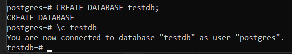

# Логический уровень PostgreSQL

### Подготовительный этап

Подготавливаем и настраиваем виртуальную машину _logicalpsql_ в Яндекс.Облаке (Ubuntu 22.04 LTS + PostgreSQL 14)

    sudo apt update && sudo apt upgrade -y && sudo sh -c 'echo "deb http://apt.postgresql.org/pub/repos/apt $(lsb_release -cs)-pgdg main" > /etc/apt/sources.list.d/pgdg.list' && wget --quiet -O - https://www.postgresql.org/media/keys/ACCC4CF8.asc | sudo apt-key add - && sudo apt-get update && sudo apt-get -y install postgresql-14

Заходим в _psql_, используя стандартного пользователя __postgres__

    sudo -u postgres psql

Создадим новую базу данных _testdb_

    CREATE DATABASE testdb;

Подключимся к созданной базе данных

    \c testdb

Создадим схему _testnm_

    CREATE SCHEMA testnm;

Создадим таблицу _t1_ с одной колонкой __c1__ типа integer

    CREATE TABLE t1 (c1 integer);

Вставим строку данных 

    INSERT INTO t1 (c1) VALUES (1);

Проверяем, что все готово

### Работа с правами доступа

Создадим новую роль __readonly__

    CREATE ROLE readonly;

Дадим новой роли необходимые разрешения (коннект к БД testdb, использование схемы testnm, SELECT из всех таблиц схемы testnm)

    GRANT CONNECT ON DATABASE testdb TO readonly;
    GRANT USAGE ON SCHEMA testnm TO readonly;
    GRANT SELECT ON ALL TABLES IN SCHEMA testnm TO readonly;

Создадим пользователя _testread_ c паролем __test123__ и добавим ему роль _readonly_

    CREATE USER testread WITH PASSWORD 'test123' LOGIN;
    ALTER GROUP readonly ADD USER testread;

Однако, если после выполнения данной команды попытаться подключиться, то получим ошибку 

Ошибка связана с тем, что в нашей ВМ нет пользователя testread. Чтобы решить проблему, необходимо изменить метод шифрования для всех пользователей с _peer_ на __scram-sha-256__ в файле pg_hba.conf

    sudo nano /etc/postgres/14/main/pg_hba.conf

Теперь можно подключиться к необходимой БД, используя пользователя _testread_

Пробуем выбрать данные из таблицы _t1_

    SELECT * FROM t1;

Получаем ошибку

Ошибка получилась вследствие того, что при создании таблицы мы не задали ей схему, в результате чего таблица создалась в схеме по умолчанию _public_, доступа к которой у пользователя нет.

Есть два пути решения данной проблемы:

1. Дать права доступа к схеме _public_
2. Перенести таблицу _t1_ в схему __testnm__

Пересоздадим таблицу в нужной схеме (под пользователем __postgres__) и добавим в нее строку

    DROP TABLE t1;
    CREATE TABLE testnm.t1 (c1 integer);
    INSERT INTO testnm.t1 (c1) VALUES (1);

Входим под пользователем testread и пробуем выбрать данные

    SELECT * FROM testnm.t1;

Получаем ошибку, так как таблица была пересоздана, а права на таблицы схемы для роли _readonly_ были розданы на все существовавшие таблицы в момент, когда таблицы t1 еще не существовало в схеме

Решением проблемы является раздача прав по умолчанию на таблицы для схемы _testnm_ роли __readonly__

    ALTER default privileges IN SCHEMA testnm GRANT SELECT ON TABLES TO readonly; 

После этого для всех таблиц в схеме _testnm_ роли __readonly__ по умолчанию будут даваться права на выборку из таблицы

Попробуем создать таблицу _t2_

    CREATE TABLE t2 (c2 integer);
    INSERT INTO t2 (c2) VALUES (2);

Прав на создание таблиц в схеме _testnm_ у пользователя __testread__ нет, но так как мы явно не задали схему таблицы, то по умолчанию она создалась в схеме _public_, где по умолчанию любой пользватель может создать таблицу

Чтобы отключить возможность создания таблиц пользователями в схеме _public_, необходимо выполнить следующие команды:

    REVOKE CREATE on SCHEMA public FROM public; 

Если после выполнения данных команд попробовать создать таблицу из-под пользователя _testread_, получим ошибку

Также мы сняли все права, в том числе и на модификацию таблиц из схемы _public_ нашей базы данных __testdb__, выполнив команду

    REVOKE ALL ON DATABASE testdb FROM public; 
