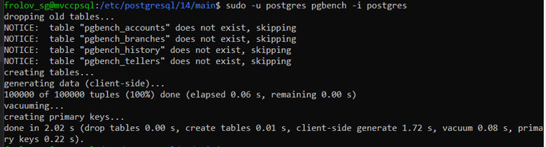
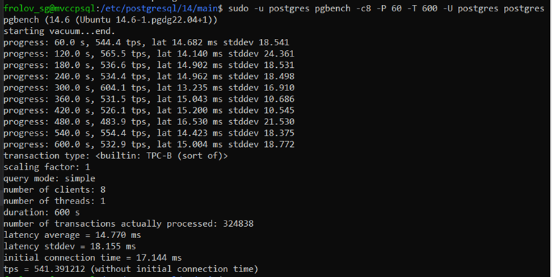
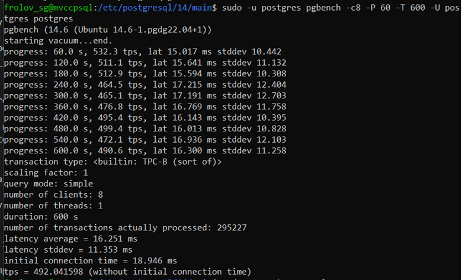
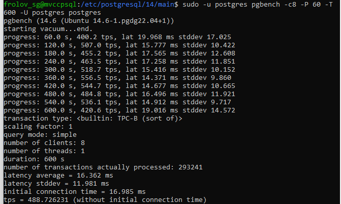
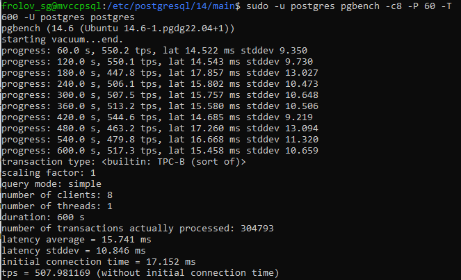
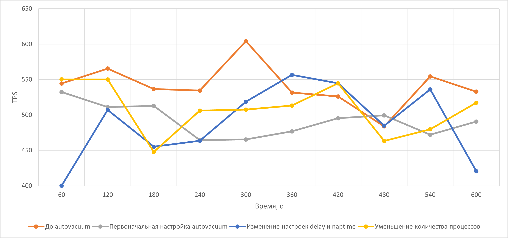

# MVCC, vacuum и autovacuum

### Подготовка к работе

Разворачиваем ВМ _mvccpsql_ на платформе Яндекс.Облако (Ubuntu 22.04 LTS, PostgreSQL 14)

    sudo apt update && sudo apt upgrade -y && sudo sh -c 'echo "deb http://apt.postgresql.org/pub/repos/apt $(lsb_release -cs)-pgdg main" > /etc/apt/sources.list.d/pgdg.list' && wget --quiet -O - https://www.postgresql.org/media/keys/ACCC4CF8.asc | sudo apt-key add - && sudo apt-get update && sudo apt-get -y install postgresql-14

Проводим настройку PostgreSQL 14 согласно [файла настроек](cluster_config.txt)

Для этого необходимо отредактировать файл настроек _postgresql.conf_

Перезапускаем кластер PostgreSQL, чтобы настройки применились

### Работа с vacuum и autovacuum

Выполним команду

    sudo -u postgres pgbench -i postgres

Ключ _-i_ указывает на инициализацию утилиты тестирования производительности __pgbench__

> Во время инициализации создаются 4 системные таблицы - _pgbench_accounts_, _pgbench_branches_, _pgbench_history_ и _pgbench_tellers_, предварительно уничтожая существующие таблицы с такими именами. Если данные имена таблиц заняты, рекомендуется переключиться на другую БД.

Запускаем команду с ключами

    sudo -u postgres pgbench -c8 -P 60 -T 600 -U postgres postgres

Ключи:
* __-с8__ - количество имитируемых клиентов (одновременных сеансов БД)
* __-P__ - вывод данных о прогрессе выполнения команды через определенное в ключе время (в секундах)
* __-T__ - выполнять команду определнное количество времени (в секундах)
* __-U__ - имя пользователя для подключения

Даем отработать команде, получаем результат

Настроим _autovacuum_ так, чтобы получить стабильные значения __tps__

Для этого необходимо отредактировать файл настроек _postgresql.conf_

1. Включаем _autovacuum_

        autovacuum = on

2. Настраиваем количество фоновых процессов _autovacuum_max_workers_
    > Хорошей практикой считается установка количества фоновых процессов autovacuum как половина от имеющегося количества ядер процессора

        autovacuum_max_workers = 3

3. Настраиваем стоимость работы каждого процесса _autovacuum_vacuum_cost_limit_

        autovacuum_vacuum_cost_limit = 1000

4. Настраиваем задержку очистки _autovacuum_vacuum_cost_delay_

        autovacuum_cost_delay = 10

5. Настраиваем абсолютный порог срабатывания _autovacuum_vacuum_threshold_ (абсолютное значение, кол-во строк)

        autovacuum_vacuum_threshold = 25

6. Настраиваем относительный порог срабатывания _autovacuum_vacuum_scale_factor_ (% от общего числа строк в таблице)

        autovacuum_vacuum_scale_factor = 0.05

7. Настраиваем задержку между запусками _autovacuum_naptime_

        autovacuum_naptime = 15s

8. Настраиваем паузу при достижении лимита всеми процессами _autovacuum_vacuum_cost_delay_

        autovacuum_vacuum_cost_delay = 2ms

Перезапустим кластер, чтобы применились настройки

    sudo -u postgres pg_ctlcluster 14 main stop
    sudo -u postgres pg_ctlcluster 14 main start

Запустим бенчмарк с такими же настройками

Получаем следующий результат

Попробуем изменить некоторые настройки autovacuum

    autovacuum_naptime = 30s
    autovacuum_vacuum_cost_delay = 5ms

Перезапустим кластер и посмотрим на результат

Вернем на место настройки naptime и cost delay и уменьшим количество worker'ов до 2

    autovacuum_max_workers = 2

Перезапустим кластер и выполним бенчмарк

Посмотрим на диаграмму изменения tps в зависимости от настройки autovacuum

Как видим, наиболее ровный график tps во времени получился при первоначальных настройках autovacuum (серая линия на диаграмме выше)

    autovacuum = on
    autovacuum_max_workers = 3
    autovacuum_vacuum_cost_limit = 1000
    autovacuum_cost_delay = 10
    autovacuum_vacuum_threshold = 25
    autovacuum_vacuum_scale_factor = 0.05
    autovacuum_naptime = 15s
    autovacuum_vacuum_cost_delay = 2ms
