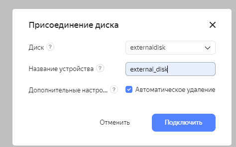
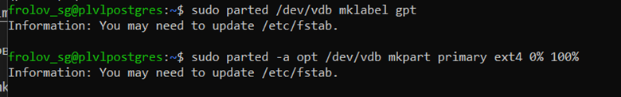

# Физический уровень PostgreSQL

### Подготовительный этап

Заходим в наше Яндекс.Облако и создаем ВМ _plvlpostgres_ с ОС __Ubuntu 20.04 LTS__

Устанавливаем на ВМ _PostgreSQL 14_

    sudo apt update && sudo apt upgrade -y && sudo sh -c 'echo "deb http://apt.postgresql.org/pub/repos/apt $(lsb_release -cs)-pgdg main" > /etc/apt/sources.list.d/pgdg.list' && wget --quiet -O - https://www.postgresql.org/media/keys/ACCC4CF8.asc | sudo apt-key add - && sudo apt-get update && sudo apt-get -y install postgresql-14

Проверяем, что кластер PostgreSQL 14 запущен
    
    sudo -u postgres pg_lsclusters

Заходим в _psql_ из-под пользователя __postgres__

    sudo -u postgres psql

Создаем необходимые тестовые таблички

    create table test(c1 text);
    insert into test values('1');
    \q

Останавливаем кластер PostgreSQL 14 

    sudo -u postgres pg_ctlcluster 14 main stop

### Создание и подключение внешнего диска к ВМ

Создаем новый диск на платформе Яндекс.Облако

    Compute Cloud -> Диски -> Создать диск

Назовем его _externaldisk_

Присоединим его к нашей виртуальной машине _plvlpostgres_

    Виртуальная машина -> Диски -> Присоединить диск

Смотрим в ВМ, что внешний диск появился в устройствах, используя команду

    lsblk

Видим, что новый диск имеет метку _vdb_ (20G)

### Форматирование свежеприкрепленного диска

> Инструкция по форматированию лежит [тут](https://www.digitalocean.com/community/tutorials/how-to-partition-and-format-storage-devices-in-linux)

Устанавливаем _parted_

    sudo apt update
    sudo apt install parted

Смотрим, какой из дисков еще не отформатирован

    sudo parted -l | grep Error

Видим, что новый диск не имеет разметки

Создаем разметку под файловую систему ext4

    sudo parted /dev/vdb mklabel gpt
    sudo parted -a opt /dev/vdb mkpart primary ext4 0% 100%

Создаем файловую систему ext4 на диске

    sudo mkfs.ext4 -L datapartition /dev/vdb1

Подмонтируем получившийся диск по умолчанию при загрузке в __/mnt/data__

    sudo nano /etc/fstab

Перезагрузим инстанс и проверим, что диск остался примонтированным

### Переносим директории с данными на внешний диск

Делаем пользователя _postgres_ владельцем папки __/mnt/data__

    sudo chown -R postgres:postgres /mnt/data/

Переносим данные PostgreSQL 14 в смонтированный диск

    sudo mv /var/lib/postgresql/14 /mnt/data

Пробуем запустить кластер _main_, получаем ошибку

Ошибка связана с тем, что мы физически перенесли расположение кластера _main_ на другой диск, а настройки не исправили

Чтобы все заработало, необходимо исправить директорию расположения данных кластера на _/mnt/data/main_ в конфиг-файле __/etc/postgresql/14/main/postgresql.conf__

    cd /etc/postgresql/14/main
    sudo nano postgresql.conf

Стартуем кластер

    sudo -u postgres pg_ctlsluster 14 main start

Проверяем данные на сохранность

Как видим, перенос папки на внешний диск не повлиял на сохранность существующих данных