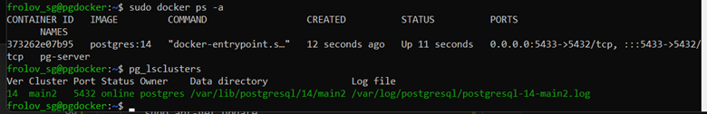

# Установка и настройка PostgreSQL в контейнере Docker

## Подготовительные работы
Для выполнения работы создадим виртуальную машину _pgdocker_ на базе Яндекс.Облако (ОС __Ubuntu 22.04 LTS__)

Подключимся к созданной виртуальной машине по _ssh_
    
    ssh %username%@%external_ip_VM%

### Примечание

Если на виртуальной машине уже установлен PostgreSQL, то по умолчанию PostgreSQL после установки разворачивает кластер с именем _main_ на стандартном порту __5432__. В данной работе нам необходимо развернуть Docker-контейнер с PostgreSQL на борту. Так как порт по умолчанию уже занят кластером установленного PostgreSQL, кластер необходимо убить для предотвращения конфликта ресурсов за порт.

Для решения данной проблемы можно:
1. "грохнуть" кластер PostgreSQL, используя команды
    
        pg_ctlcluster %version% %clustername% stop
        pg_dropcluster %version% %clustername%

    где _%version%_ - версия кластера, _%clustername%_ - имя кластера

2. либо настроить маршрутизацию портов при развертывании Docker-контейнера

    
    

## Установка и настройка PostgreSQL 14 в Docker

>Углубленная информация по Docker на Habr'e [тут](https://habr.com/ru/post/310460/)

Устанавливаем [Docker](https://www.docker.com/), используя команду
    
    curl -fsSL https://get.docker.com -o get-docker.sh && sudo sh get-docker.sh && rm get-docker.sh && sudo usermod -aG docker $USER

После установки Docker необходимо создать Docker-сеть
    
    sudo docker network create pg-net

Создаем каталог, в котором мы будем хранить данные БД, и который мы будем монтировать в контейнер
    
    mkdir /var/lib/postgres

Подключаем созданную Docker-сеть к контейнеру сервера PostrgreSQL 14

    sudo docker run --name pg-server --network pg-net -e POSTGRES_PASSWORD=postgres -d -p 5432:5432 -v /var/lib/postgres:/var/lib/postgresql/data postgres:14

* __--name__ - задает название контейнера
* __--network__ - ключ указывает, к какой Docker-сети подключается создаваемый контейнер
* __-e__ - добавление переменных среды в контейнер
* __-d__ - запуск контейнера в фоновом режиме
* __-p %ext_port%:%int_port%__ - проброс порта из контейнера наружу
* __-v %ext_dir%:%int_dir%__ - монтирование внешней директории в указанную внутреннюю
* __postgres:14__ - указание, что в качестве образа для Docker-контейнера мы будем использовать официальный образ PostgreSQL контретной версии (14) с сервера [DockerHub](https://hub.docker.com/)

Как видно из скриншота выше, Docker при попытке установки и настройки контейнера сначала произвел поиск локального образа postgres 14 версии, не нашел его и скачал с официального сайта

## Проверка сохранения данных в БД при пересоздании Docker-контейнера PostgreSQL

Отобразим наши текущие Docker-контейнеры
    
    sudo docker ps -a

Запустим отдельный контейнер с клиентом к контейнеру БД
    
    sudo docker run -it --rm --network pg-net --name pg-client postgres:14 psql -h pg-server -U postgres

* __-it__ - запускает контейнер в текущем окне
* __--rm__ - автоматически удаляет контейнер после завершения работы

Проверим из второго окна, что сейчас в Docker запущено два контейнера - _pg-client_ и _pg-server_

Создадим базу данных, табличку и добавим в нее пару записей

Пробуем подключиться к Docker-контейнеру извне

    psql -p %port% -U postgres -h %ext_ip_VM% -d postgres -W

где _%port%_ - номер порта, на котором висит контейнер PostgreSQL

Примечание для того, у кого на локальной машине не установлена PostgreSQL (как, например, я).

    Для того, чтобы была возможность подключиться извне, необходимо выполнить следующие действия:
    1.  Установить postgresql-client 
        1.1. Добавляем репозиторий командой
         sudo sh -c 'echo "deb http://apt.postgresql.org/pub/repos/apt $(lsb_release -cs)-pgdg main" > /etc/apt/sources.list.d/pgdg.list'
    2. Добавляем ключ доступа
        wget --quiet -O - https://www.postgresql.org/media/keys/ACCC4CF8.asc | sudo apt-key add -
    3. Обновляем список пакетов
        sudo apt-get update
    4. Устанавливаем пакет postgresql-client
        sudo apt-get install postgresql-client
    5. После этого получаем возможность открывать консоль работы с PostgreSQL (psql) на локальной машине 

Проверяем, что все данные на месте

Удаляем контейнер с сервером и создаем его заново

Подключаемся к пересозданному серверу, используя Docker-контейнер клиент

Подключаемся к пересозданному серверу извне

Сохранность данных после пересоздания контейнера обусловлена тем, что хранилище данных сервера PostgreSQL 14, разворачиваемого внутри Docker-контейнера, физически расположено вне контейнера в операционной системе-родителе, а внутрь контейнера директория лишь монтируется в нужное место.

## Docker Сompose

### Основная информация 
[Docker Compose](https://github.com/docker/compose) позволяет управлять несколькими контейнерами одновременно, делая контейнеризацию более организованной.

Если приложение состоит из нескольких компонентов, каждый из которых разворачивается в своем Docker-контейнере, то технология Docker Compose позволяет разворачивать данные контейнеры в нужной нам последовательности, используя лишь один файл _docker-compose.yml_, в котором необходимо указать последовательность сборки Docker-контейнеров.

### Пример _docker-compose.yml_

    version: "3"
    services:
        web:
            build: .
            ports:
            - "5000:5000"
            volumes:
            - .:/code
        redis:
            image: redis

Ключевое слово _version_ указывает на версию схемы, которую мы используем (зависит от версии установленного Docker)

Блок _services_ содержит в себе список Docker-контейнеров, требуемых к сборке

Каждый из контейнеров в свою очередь содержит свои параметры:
* web
    * _build_ - что будем собирать (папка с исходниками, где лежит __Dockerfile__)
    * _ports_ - какие порты необходимо пробросить внутрь контейнера
    * _volumes_ - какие папки необходимо примонтировать внутрь контейнера и куда
* redis
    * _image_ - какой образ использовать при развертывании контейнера

Дополнительные полезные параметры:
* _environment_ - добавляет переменные окружения в контейнер
* _depends\_on_ - выстраивает зависимость запускаемого контейнера относительно других (например, в сервис _web_ можно добавить данный параметр со значением _redis_, чтобы сервис _web_ запустился только после развертывания контейнера _redis_)

### Основные команды для работы с Docker Compose

Осуществить сборку сервисов, описанных в конфигурационном файле:

    docker-compose build

Запустить собранные сервисы:

    docker-compose up

* _-d_  позволяет выполнить запуск в фоне
* _--abort-on-container-exit_ - остановка всех контейнеров при сбое хотя бы в одном

Запуск определенного сервиса

    docker-compose run %servicename% %command%

* _%servicename%_ - название сервиса из конфигурационного файла docker-compose.yml
* _%command%_ - команда, которую необходимо выполнить внутри сервиса

Остановка и удаление всех сервисов, запущенных с помощью _up_

    docker-compose down

